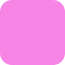

<h1 style="text-align: center; font-weight: bolder"> Dark Minimalist </h1>

  

  

Dark Minimalist is a dark color palette that aims to provide strong distinguishable colors that not tire the eyes, so you can 
work in your projects for long periods of time. This repository contains the colors used in the palette and the ports for all the programs that allow color customizations.

## 🎨 Colors

<table align="center">
    <tr>
        <th></th>
        <th style="text-align: center">Hex</th>
        <th style="text-align: center">RGB</th>
        <th style="text-align: center">HSL</th>
    </tr>
    <tr>
        <td></td>
        <td><code>#fdddf5</code></td>
        <td><code>rgb(253, 221, 245)</code></td>
        <td><code>hsl(315, 89%, 94%)</code></td>
    </tr>
    <tr>
        <td></td>
        <td><code>#f9aee9</code></td>
        <td><code>rgb(249, 174, 233)</code></td>
        <td><code>hsl(303, 87%, 81%)</code></td>
    </tr>
    <tr>
        <td></td>
        <td><code>#f685e6</code></td>
        <td><code>rgb(246, 133, 230)</code></td>
        <td><code>hsl(300, 86%, 72%)</code></td>
    </tr>
    <tr>
        <td></td>
        <td><code>#d484f4</code></td>
        <td><code>rgb(212, 132, 244)</code></td>
        <td><code>hsl(270, 85%, 75%)</code></td>
    </tr>
    <tr>
        <td></td>
        <td><code>#f67d7b</code></td>
        <td><code>rgb(246, 125, 123)</code></td>
        <td><code>hsl(1, 88%, 73%)</code></td>
    </tr>
    <tr>
        <td></td>
        <td><code>#f7859f</code></td>
        <td><code>rgb(247, 133, 159)</code></td>
        <td><code>hsl(343, 88%, 74%)</code></td>
    </tr>
    <tr>
        <td></td>
        <td><code>#f7a285</code></td>
        <td><code>rgb(247, 162, 133)</code></td>
        <td><code>hsl(22, 87%, 75%)</code></td>
    </tr>
    <tr>
        <td></td>
        <td><code>#f3eb84</code></td>
        <td><code>rgb(243, 235, 132)</code></td>
        <td><code>hsl(57, 85%, 71%)</code></td>
    </tr>
    <tr>
        <td></td>
        <td><code>#96f685</code></td>
        <td><code>rgb(150, 246, 133)</code></td>
        <td><code>hsl(108, 89%, 71%)</code></td>
    </tr>
    <tr>
        <td></td>
        <td><code>#85f7cc</code></td>
        <td><code>rgb(133, 247, 204)</code></td>
        <td><code>hsl(158, 88%, 73%)</code></td>
    </tr>
    <tr>
        <td></td>
        <td><code>#85f7f1</code></td>
        <td><code>rgb(133, 247, 241)</code></td>
        <td><code>hsl(178, 88%, 73%)</code></td>
    </tr>
    <tr>
        <td></td>
        <td><code>#a7f9e2</code></td>
        <td><code>rgb(167, 249, 226)</code></td>
        <td><code>hsl(160, 86%, 81%)</code></td>
    </tr>
    <tr>
        <td></td>
        <td><code>#85bef7</code></td>
        <td><code>rgb(133, 190, 247)</code></td>
        <td><code>hsl(212, 88%, 76%)</code></td>
    </tr>
    <tr>
        <td></td>
        <td><code>#abc0f9</code></td>
        <td><code>rgb(171, 192, 249)</code></td>
        <td><code>hsl(221, 89%, 85%)</code></td>
    </tr>
    <tr>
        <td></td>
        <td><code>#e5e5e5</code></td>
        <td><code>rgb(229, 229, 229)</code></td>
        <td><code>hsl(0, 0%, 90%)</code></td>
    </tr>
    <tr>
        <td></td>
        <td><code>#d0d1d3</code></td>
        <td><code>rgb(208, 209, 211)</code></td>
        <td><code>hsl(210, 2%, 82%)</code></td>
    </tr>
    <tr>
        <td></td>
        <td><code>#b9b9c0</code></td>
        <td><code>rgb(185, 185, 192)</code></td>
        <td><code>hsl(240, 4%, 73%)</code></td>
    </tr>
    <tr>
        <td></td>
        <td><code>#9e9da9</code></td>
        <td><code>rgb(158, 157, 169)</code></td>
        <td><code>hsl(240, 6%, 64%)</code></td>
    </tr>
    <tr>
        <td></td>
        <td><code>#868592</code></td>
        <td><code>rgb(134, 133, 146)</code></td>
        <td><code>hsl(240, 5%, 54%)</code></td>
    </tr>
    <tr>
        <td></td>
        <td><code>#757480</code></td>
        <td><code>rgb(117, 116, 128)</code></td>
        <td><code>hsl(240, 5%, 48%)</code></td>
    </tr>
    <tr>
        <td></td>
        <td><code>#605f6b</code></td>
        <td><code>rgb(96, 95, 107)</code></td>
        <td><code>hsl(240, 6%, 40%)</code></td>
    </tr>
    <tr>
        <td></td>
        <td><code>#4d4b56</code></td>
        <td><code>rgb(77, 75, 86)</code></td>
        <td><code>hsl(240, 7%, 31%)</code></td>
    </tr>
    <tr>
        <td></td>
        <td><code>#3b3a44</code></td>
        <td><code>rgb(59, 58, 68)</code></td>
        <td><code>hsl(240, 7%, 23%)</code></td>
    </tr>
    <tr>
        <td></td>
        <td><code>#2b2a33</code></td>
        <td><code>rgb(43, 42, 51)</code></td>
        <td><code>hsl(240, 7%, 16%)</code></td>
    </tr>
    <tr>
        <td></td>
        <td><code>#211f27</code></td>
        <td><code>rgb(33, 31, 39)</code></td>
        <td><code>hsl(240, 7%, 11%)</code></td>
    </tr>
    <tr>
        <td></td>
        <td><code>#1c1b22</code></td>
        <td><code>rgb(28, 27, 34)</code></td>
        <td><code>hsl(240, 7%, 9%)</code></td>
    </tr>
</table>

## ❤️ Gratitude

My whole appreciation to the tools, projects, and people who makde this project possible:

- [Catppuccin Theme](https://github.com/catppuccin/catppuccin): For being the project which inspired me to start this repository.
- All the people who used, ported or likes thi palette.