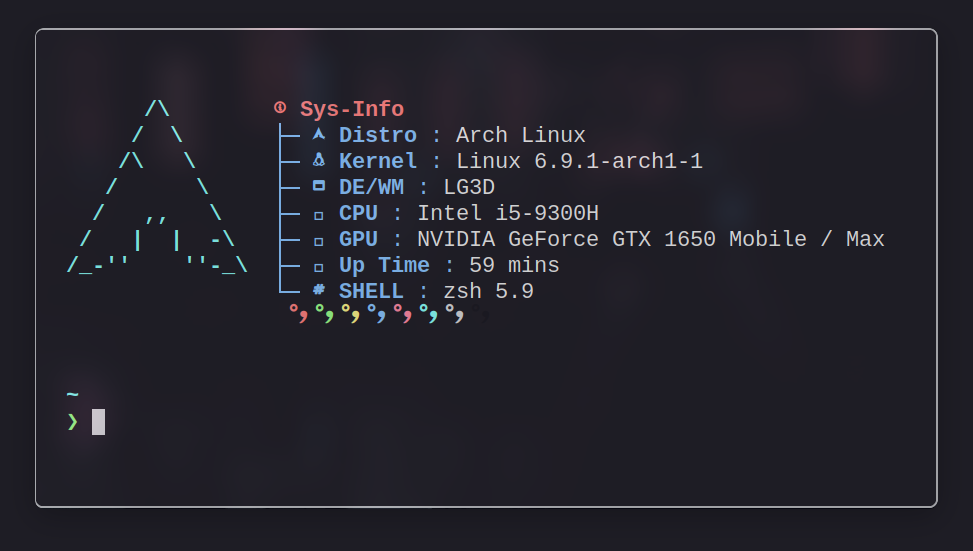

<h1 align="center"> 
    <br/>
    Dark Minimalist for <a href="https://github.com/alacritty/alacritty">Alacritty</a>
</h1>

## Preview



## Usage

1. Copy the theme files next to your `alacritty.toml` configuration file.
   See [Alacritty's README](https://github.com/alacritty/alacritty#configuration) to see where your config file can be
   stored, it is usually stored at `~/.config/alacritty/alacritty.toml`

    ```shell
    curl -LO --output-dir ~/.config/alacritty https://github.com/LeonN534/Dark-Minimalist/raw/main/ports/alacritty/alacritty.toml
    ```
2. Import the theme config in your `alacritty.toml`:

    ```toml
    import = [
      "~/.config/alacritty/dark-minimalist.toml"
    ]
    ```