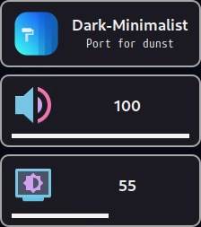

<h1 align="center"> 
    <br/>
    Dark Minimalist for <a href="https://github.com/dunst-project/dunst">Dunst</a>
</h1>

## Preview

<p align="center">
    
</p>

## Usage

1. Download the theme from the [theme](theme) directory.
2. Copy the theme into `$HOME/.config/dunst`.
3. Modify the line where your dunst instance is iniciated to use the `dark-minimalist.dunstrc` file as config file:
```shell
# Launch dunst
dunst -config "${DUNST_DIR}/dark-minimalist.dunstrc" &
```
