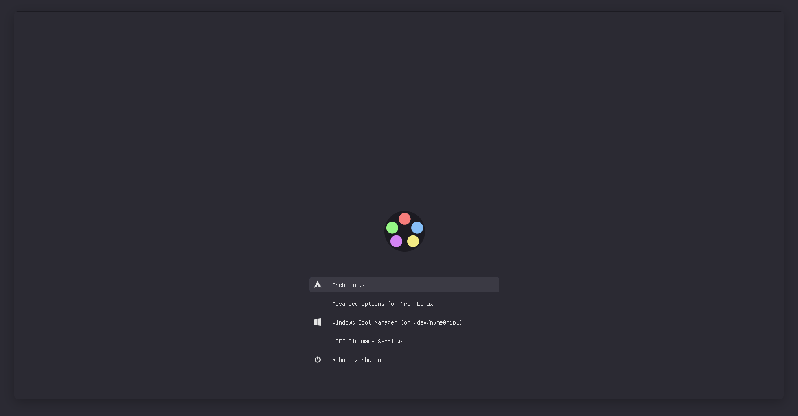

<h1 align="center"> 
    <br/>
    Dark Minimalist for <a href="https://www.gnu.org/software/grub/">Grub</a>
</h1>

## Preview

<p align="center">
    
</p>

## Usage

1. Clone this repository locally and enter the cloned folder:

    ```shell
    git clone https://github.com/LeonN534/Dark-Minimalist.git && cd Dark-Minimalist
    ```

2. Copy the theme from `src` folder to
`/usr/share/grub/themes/`.

    ```shell
    sudo cp -r src/dark-minimalist-grub-theme /usr/share/grub/themes/
    ```

3. Uncomment and edit following line in `/etc/default/grub` to your selected
   theme:

    ```shell
    GRUB_THEME="/usr/share/grub/themes/dark-minimalist-grub-theme/theme.txt"
    ```

4. Update grub:

    ```shell
    sudo grub-mkconfig -o /boot/grub/grub.cfg
    ```

    For Fedora:

    ```shell
    sudo grub2-mkconfig -o /boot/grub2/grub.cfg
    ```