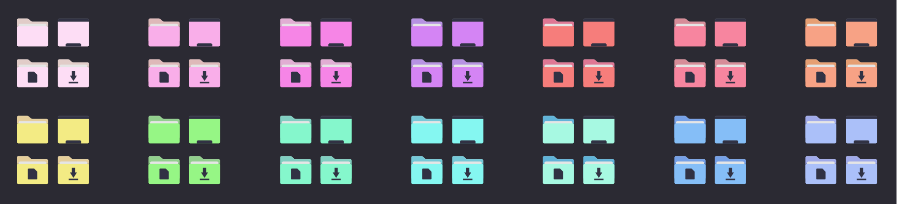

<h1 align="center"> 
    <br/>
    Dark Minimalist for <a href="https://github.com/PapirusDevelopmentTeam/papirus-icon-theme">Papirus Folders</a>
</h1>

## Preview

<p align="center">
    
</p>

## Usage

1. Make sure You have [Papirus Icon Theme](https://github.com/PapirusDevelopmentTeam/papirus-icon-theme) installed
2. Download the zip file inside the src directory, extract it and change into the `dark-minimalist-papirus-folders`
   ```shell
   7z x dark-minimalist-papirus-folders.7z
   cd dark-minimalist-papirus-folders
   ```
3. Copy content of the folder to `/usr/share/icons/Papirus/`:
   ```shell
   sudo cp -r * /usr/share/icons/Papirus
   ```
4. Install `papirus-folders` script from [Papirus Icon Theme](https://github.com/PapirusDevelopmentTeam/papirus-icon-theme):

   ```shell
   curl -LO https://raw.githubusercontent.com/PapirusDevelopmentTeam/papirus-folders/master/papirus-folders && chmod +x ./papirus-folders
   ```

5. Use this script to set color of the folders, for example:

   ```shell
   ./papirus-folders -C dark-minimalist-blue --theme Papirus-Dark
   ```

6. To check all available colors:

   ```shell
   ./papirus-folders -l
   ```

   all colors are named as `dark-minimalist-"colour"`

   for example:

   `dark-minimalist-blue`, `dark-minimalist-green`, `dark-minimalist-red`...

7. Visit [Papirus-folders](https://github.com/PapirusDevelopmentTeam/papirus-folders) to learn more about this script
