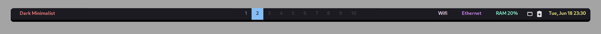

<h1 align="center"> 
     
    Dark Minimalist for <a href="https://github.com/polybar/polybar">Polybar</a>
</h1>

## Preview

    

## Usage

1. Copy/move the theme from [`src/`](./src/) to your Polybar configuration directory (typically `~/.config/polybar`).
2. Include the file in your `config.ini` under `[global/wm]` by adding `include-file = $HOME/.config/polybar/dark-minimalist.ini`.
