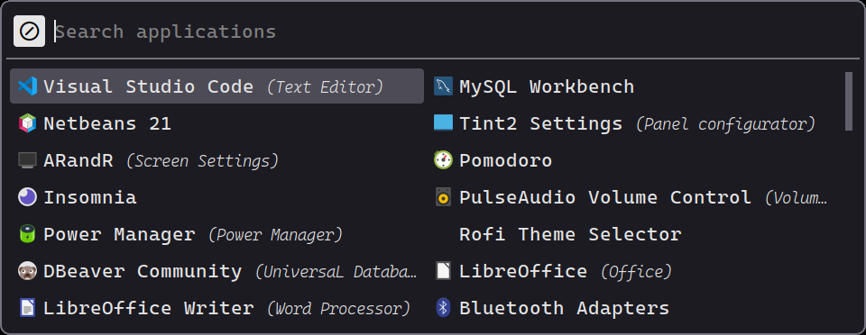

<h1 align="center"> 
    <br/>
    Dark Minimalist for <a href="https://github.com/davatorium/rofi">Rofi</a>
</h1>

## Preview

<p align="center">
    
</p>

## Usage

### Importing the palette

In order to use the color palette into your custom theme, you have to download the [dark-minimalist.rasi](https://github.com/LeonN534/Dark-Minimalist/blob/main/ports/rofi/src/themes/dark-minimalist.rasi) file and paste it into the folder of your theme. Then, import the theme:

```rasi
@import "path/to/dark-minimalist.rasi"
```

### Using provided configs

Another way is just using the theme showed in the [preview](#preview) section. There are three config files, an application launcher, a power menu and a wallpaper setter.

To install any of the configs you need to do the following:

- If not exist, create the rofi config folder:
```shell
mkdir .config/rofi
```

- Clone the repo, copy the content of the ```src``` folder inside the rofi config folder.

```shell
cp -r Dark-Minimalist/ports/rofi/src/* ~/.config/rofi
```

- Delete the undesired configs with the respective script. For example, deleting the power menu config:

```shell
cd ~/.config/rofi/
rm config-power.rasi scripts/rofi-power.sh scripts/modi-session.sh
```
