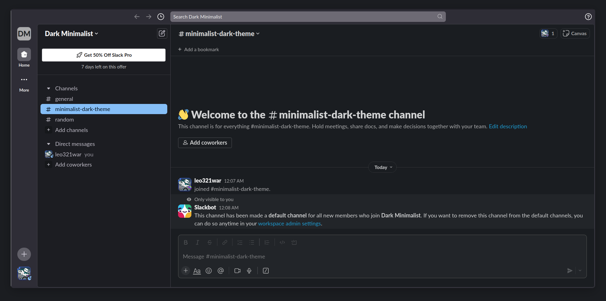

<h1 align="center"> 
    <br/>
    Dark Minimalist for <a href="https://slack.com">Slack</a>
</h1>

## Preview



## Usage

> [!IMPORTANT]
> Due to Slack's new
> [redesign](https://slack.com/intl/en-gb/blog/productivity/a-redesigned-slack-built-for-focus),
> the theme strings don't directly apply the
> palette, and instead they are mapped to Slack's built-in colors. However, the
> theme strings work as intended on older versions of Slack.

### Redesign

1. Click your profile picture in the bottom left.
2. Head to `Preferences` → `Themes`
3. Copy one of the [theme string](#theme-string) shown below.
4. Paste theme string into `Import theme`

### Legacy

1. Open Slack Desktop, click your profile picture in the top right.
2. Head to `Preferences` → `Themes`
3. Copy one of the [theme string](#theme-string) shown below.
3. Below `Colors`, click `Create a custom theme`, and paste your theme string.


### Theme String

- Make sure to enable dark mode!
  ```
  #2B2A33, #F8F8FA, #85BEF7, #2B2A33, #1C1B22, #E5E5E5, #85BEF7, #F7859F, #2B2A33, #CDD6F4
  ```